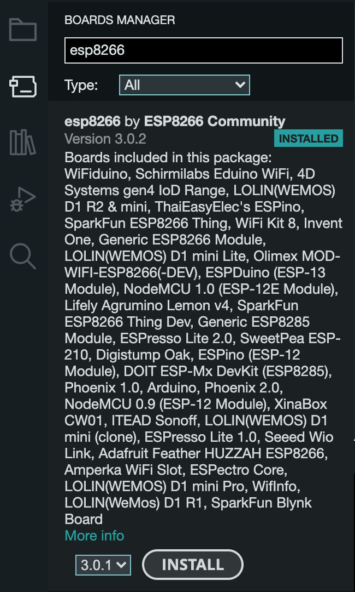
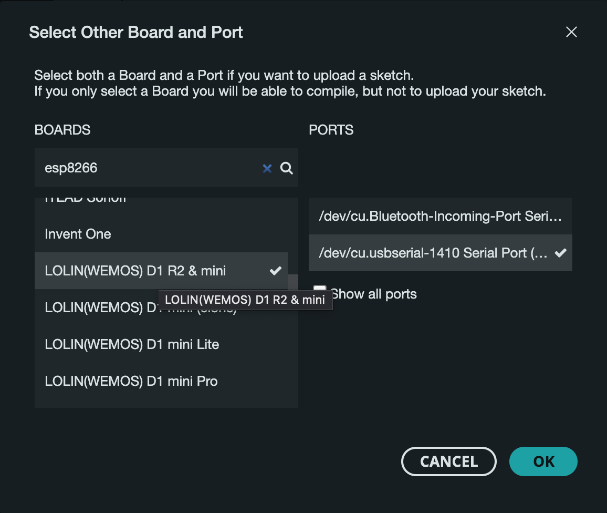
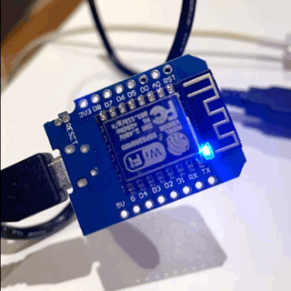
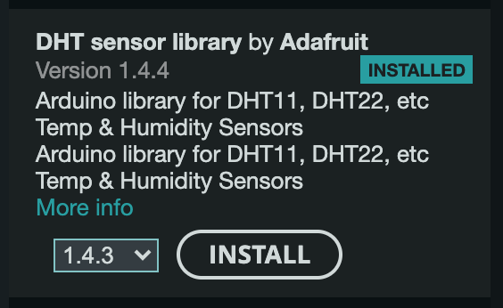

# 🐌 Snail humitity monitor


## Getting code on to the ESP8266

### Configuring the IDE

The first step is how to get code onto the ESP8266. This can be done using the [Arduino IDE](https://www.arduino.cc/en/software). 

Additional libraries need to be installed so that the IDE can compile code and communicate with the board. We need to add the ESP8266 library to do this. Details can be found from the the ESP8266 project's [GitHub page](https://github.com/esp8266/Arduino#installing-with-boards-manager). What we need as a URL that we can use to configure the Board Manager in the IDE.

```url
https://arduino.esp8266.com/stable/package_esp8266com_index.json
```

In the IDE go to Preferences and add the above URL as an "Additional board manager URL".

Next, using the Board Manager we can install the ESP8266 package to make the library accassible. 

The final step is to set the IDE to the correct board and port. This particular board is the `LOLIN(WEMOS) D1 R2 & mini`.



### Blink blink blink (Hello World)

Now that the IDE can talk to the board, the next step is to write some simple code and upload it. 

This board has a build in LED on pin D4. The code below will blink the LED at 1 second intervals.

```cpp
void setup() {
  pinMode(D4, OUTPUT);
}

void loop() {
  digitalWrite(D4, HIGH);
  delay(1000);
  digitalWrite(D4, LOW);
  delay(1000);
}
```

Once the code is written we hit the upload button. After a few seconds the LED will begin blinking. 



## Tasks

- [ ] Understand how to use the wi-fi mini

[How to Setup and Program NodeMCU ESP8266–Complete Guide - YouTube](https://www.youtube.com/watch?v=YN522_npNqs)

[A Beginner's Guide to the ESP8266](https://tttapa.github.io/ESP8266/Chap10%20-%20Simple%20Web%20Server.html)


[DHT-sensor-library/DHTtester.ino at master · adafruit/DHT-sensor-library · GitHub](https://github.com/adafruit/DHT-sensor-library/blob/master/examples/DHTtester/DHTtester.ino)




